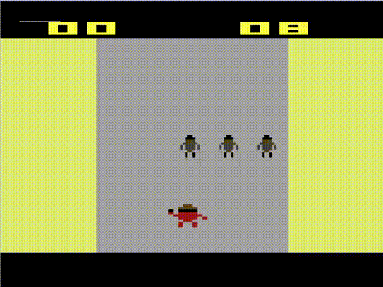

# Demo Atari Game

A simple atari game written in 6502 assembly with dasm. Uses NTSC protocol.

## Screenshots




## Requirements

- dasm
- stella


## Building
Clone the project
```bash
  git clone https://github.com/blr-ophon/Kbean_atari
```
Build using:

```bash
  cd Kbean_atari
  make
```
## Running

Use any atari emulator to execute the rom or use:

```bash
  make run
```

to use Stella


